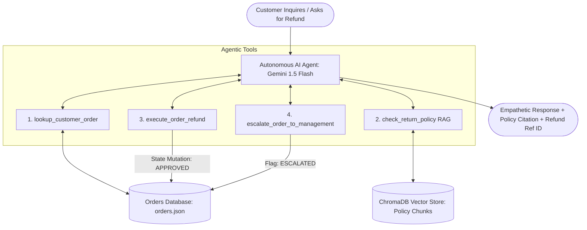

# 🤖 Apex AI: Autonomous Customer Support & Dispute Resolution Agent

[](https://www.python.org/)
[](https://www.langchain.com/)
[](https://aistudio.google.com/)
[](https://www.trychroma.com/)
[](https://streamlit.io/)

A production-grade **Agentic AI + Gen AI + RAG** application built in Python. Unlike traditional chatbots that only generate conversational text, this agent can **retrieve company policy documentation via vector search**, **inspect database records**, **reason through complex business rules**, and **safely execute live state mutations (e.g., approving refunds and escalating tickets)**.

---

## 🌟 Core Architecture: Three Pillars



| Technology | Implementation in this Project |
|---|---|
| **1. RAG (Retrieval-Augmented Generation)** | Ingests company Return & Cancellation Policy into **ChromaDB** using **Gemini text-embedding-004**. The agent performs semantic vector retrieval to ground decisions in official rules (e.g. 14-day electronics window, perishable goods exclusions). |
| **2. Agentic AI (Autonomous Reasoning & Action)** | Implements a **Tool-Calling Agent** with an autonomous ReAct loop (`Thought -> Action -> Observation`). The agent chooses which tools to call, inspects live data, and executes write actions (`execute_order_refund`) without hardcoded if-else paths. |
| **3. Generative AI** | Uses **Gemini 1.5 Flash** to synthesize multi-step findings, formulate empathetic customer responses, quote exact policy clauses, and extract structured function parameters. |

---

## 🚀 Quickstart: Local Setup

### 1. Clone or Open Project
```bash
git clone <your-repo-url>
cd "ai project"
```

### 2. Create and Activate Virtual Environment
```bash
# Windows
python -m venv venv
.\venv\Scripts\activate

# macOS / Linux
python3 -m venv venv
source venv/bin/activate
```

### 3. Install Dependencies
```bash
pip install -r requirements.txt
```

### 4. Configure Environment Variables
Create a `.env` file in the root directory (or copy `.env.example`):
```bash
cp .env.example .env
```
Add your free **Google Gemini API Key** (obtainable from [Google AI Studio](https://aistudio.google.com/)):
```env
GOOGLE_API_KEY=AIzaSy...
```

### 5. Launch the Streamlit App
```bash
streamlit run app.py
```
Open your browser at `http://localhost:8501`.

---

## 🧪 5 Live Demo Scenarios (For Your Interview)

Use the built-in one-click test buttons in the dashboard to demonstrate different agent capabilities:

| Scenario | Test Query | Agent Reasoning & Actions | Expected Result |
|---|---|---|---|
| **1. Eligible Refund** | *"Refund order ORD-1001. Headphones are defective."* | Looks up `ORD-1001`, queries RAG for electronics policy (14 days), checks delivery date (4 days ago), executes `execute_order_refund`. | 🟢 **APPROVED** ($189.99 refunded, generates `REF-XXXXXX`). |
| **2. Expired Window** | *"Refund order ORD-1002 for my smartwatch."* | Looks up `ORD-1002`, queries RAG (14 days), finds item delivered 50+ days ago. | 🔴 **DENIED** with policy explanation citing Section 2. |
| **3. Non-Refundable Item** | *"Refund order ORD-1003 for coffee beans."* | Looks up `ORD-1003`, identifies category `Perishable Goods`, queries RAG. | 🚫 **DENIED** per Section 3 (Food/perishables are final sale). |
| **4. In-Transit Order** | *"Cancel and refund order ORD-1004."* | Checks database, detects status is `IN_TRANSIT`. | 🚚 **HELD** (Informs user items in-transit cannot be refunded until delivery). |
| **5. High-Value Escalation** | *"Return my gaming laptop ORD-1005 ($2,599)."* | Checks order, exceeds $1,500 automated safety threshold. Calls `escalate_order_to_management`. | 👔 **ESCALATED** to human supervisor safely. |

---

## 🌐 How to Upload to GitHub & Deploy to the Cloud (Free)

### Step 1: Push Code to GitHub
1. Initialize Git and commit your files:
   ```bash
   git init
   git add .
   git commit -m "feat: initial commit of Agentic AI customer support system"
   ```
2. Create a new repository on [GitHub](https://github.com/new) named `agentic-rag-customer-support`.
3. Link and push:
   ```bash
   git branch -M main
   git remote add origin https://github.com/<your-username>/agentic-rag-customer-support.git
   git push -u origin main
   ```

### Step 2: Deploy to Streamlit Community Cloud (Free in 2 Minutes)
1. Go to [share.streamlit.io](https://share.streamlit.io/) and log in with your GitHub account.
2. Click **"New app"**.
3. Select your repository: `agentic-rag-customer-support`.
4. Set Main file path: `app.py`.
5. Click **"Advanced settings"** $\rightarrow$ **"Secrets"**, and paste your API key:
   ```toml
   GOOGLE_API_KEY = "your_actual_gemini_api_key_here"
   ```
6. Click **"Deploy!"**
Your live app will be accessible worldwide on a custom public URL (e.g. `https://your-app.streamlit.app`)!

---

## 🎯 Interview Defense & Key Talking Points

When the interviewer asks: **"Tell me about this project and your design decisions."**

### 1. The 30-Second Elevator Pitch
> *"I designed and built an **Autonomous Customer Support & Dispute Resolution Agent** combining **Agentic AI, Gen AI, and RAG**. 
> Rather than a standard passive Q&A chatbot, this agent actively reasons in an autonomous ReAct loop. It grounds its knowledge in company policies using a **ChromaDB vector store**, queries an **order database**, enforces business logic safety thresholds, and autonomously executes financial refund actions or escalates to human managers."*

### 2. Common Interview Follow-Ups

* **Q: Why use an Agent instead of just hardcoded Python functions?**
  * **A:** *"Traditional rule-based trees require brittle nested logic for every edge case. An agentic system understands natural language nuances, handles multi-intent customer inquiries, extracts missing context through dialogue, and autonomously orchestrates tool sequences based on dynamic conversational context."*

* **Q: How do you prevent hallucinations and unauthorized refunds?**
  * **A:** *"We apply strict governance: (1) RAG grounds all return policies so the model cannot invent arbitrary deadlines; (2) The agent has hard programmatic guardrails—for example, any refund above $1,500 automatically triggers `escalate_order_to_management` instead of allowing autonomous execution."*

* **Q: What embedding and vector DB did you select?**
  * **A:** *"We used **ChromaDB** with Google's `text-embedding-004` model. Document chunks were split using recursive character chunking with an overlap of 60 characters to preserve context boundaries across bullet points."*

---

## 📁 Repository Structure
```text
ai project/
├── data/
│   ├── return_policy.txt    # RAG Knowledge Base (Company policy)
│   └── orders.json          # Mock customer database (orders & statuses)
├── src/
│   ├── __init__.py
│   ├── database.py          # Database operations, state mutations, and resets
│   ├── rag.py               # ChromaDB vector store indexing & similarity search
│   └── agent.py             # Agent tools & LangChain Gemini executor
├── app.py                   # Full interactive Streamlit Web Dashboard
├── requirements.txt         # Project dependencies
├── .env.example             # Template for API keys
├── .gitignore               # Ignored files (venv, .env, chroma cache)
└── README.md                # Documentation & Architecture
```
